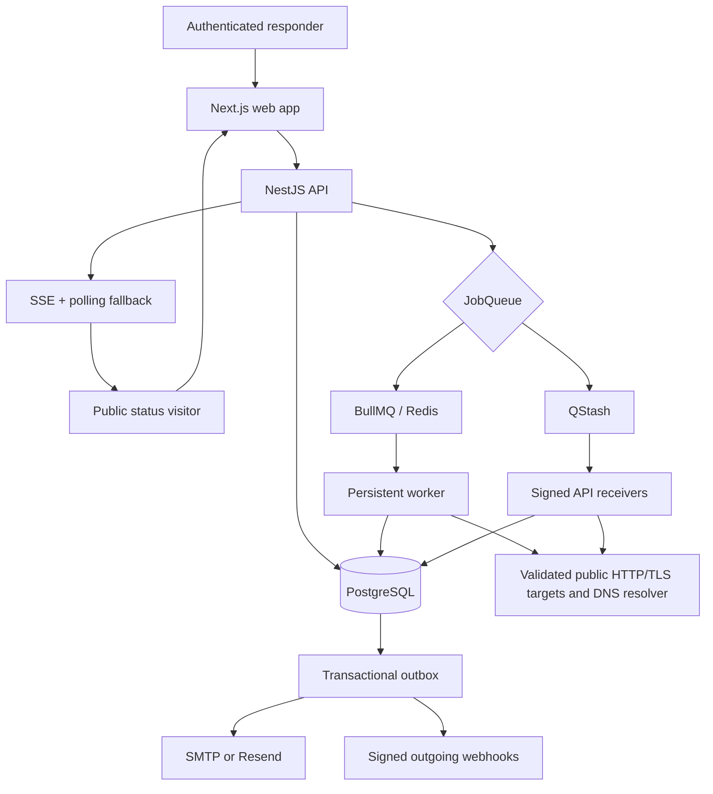
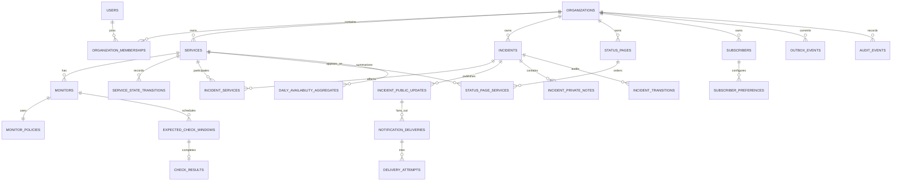
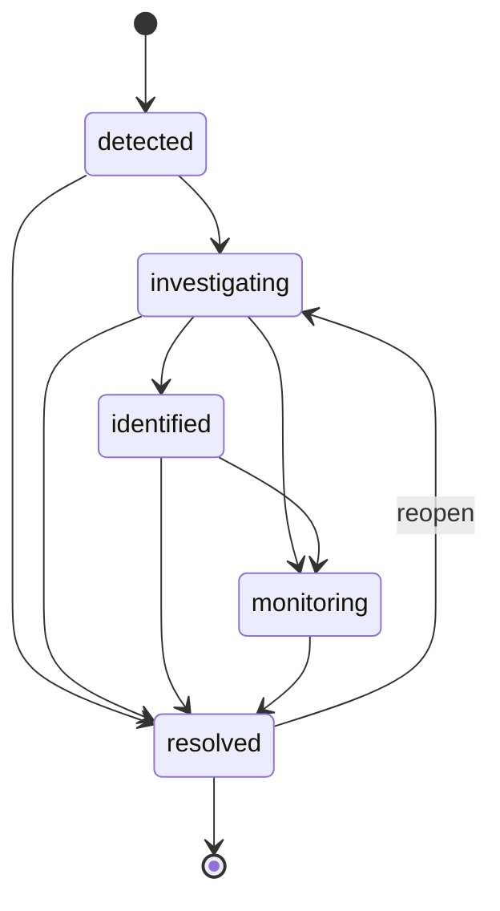
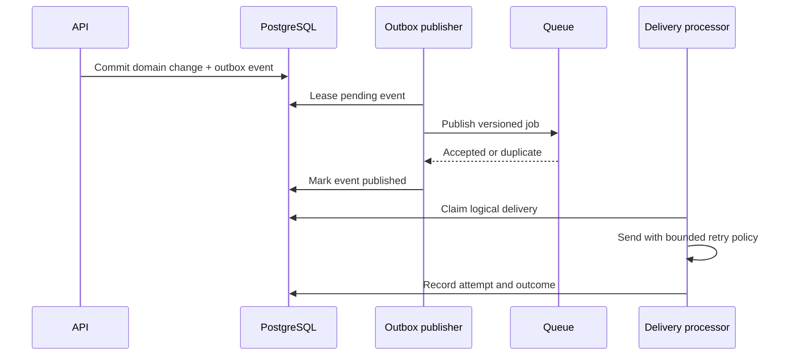

# DevRelay engineering architecture

This document describes the MVP release as implemented. DevRelay is a TypeScript modular monolith: the web, API, and persistent worker are separate deployable processes, but they share versioned contracts, one relational model, and one repository. PostgreSQL is authoritative; queues accelerate work but do not own business state.

## System context

Trust does not automatically cross an arrow. Browser mutations require an authenticated session, organization context, role authorization, and origin checks. Provider callbacks require a valid signature and replay claim. Outbound URLs are validated and their DNS result is pinned before connection.

## Why a modular monolith

The product needs transactional consistency across check results, service state, incidents, public updates, notifications, and audit events. Keeping these modules behind one database makes the critical invariants reviewable and testable without distributed transactions. Separate processes still isolate interactive HTTP work from persistent local jobs. Microservices are deferred until independent scaling or ownership creates a concrete need that outweighs deployment, tracing, versioning, and consistency costs.

## Source-of-truth rules

PostgreSQL owns:

- monitor schedules and expected check windows;
- check evidence and evaluated service state;
- incident lifecycle and public/private timelines;
- notification intent, attempts, and terminal outcome;
- queue/outbox idempotency claims;
- tenant membership, authorization, and audit history; and
- retention evidence and availability aggregates.

Redis and QStash may lose, duplicate, delay, or redeliver messages without redefining state. A scheduler interruption is repaired from pending database windows. Worker health and evidence freshness are recorded separately so missing work becomes `Unknown` rather than falsely operational.

## Core entity model

The diagram shows domain ownership and high-value relations rather than every authentication/provider field.

Every tenant-owned table includes organization ownership. Composite foreign keys and tenant-scoped queries keep related rows inside the same organization. Public routes use status-page slugs and an allowlisted projection instead of internal tenant identifiers or unrestricted domain objects.

## Monitoring and incident workflow

1. The scheduler derives a deterministic monitor window and persists it before publishing work.
2. The executor validates the versioned job and atomically claims the expected window.
3. The monitoring client selects the versioned HTTP, TLS, or DNS configuration. HTTP and TLS validate public destinations and pin the connection; TLS also uses SNI and platform trust/hostname validation. DNS permits only A, AAAA, CNAME, MX, and TXT lookups with a bounded deadline and exact normalized record-set comparison.
4. A unique `(organization, monitor, scheduled_at)` result records protocol, region, safe code and bounded evidence without raw response bodies, certificates, or resolver answers.
5. The policy engine evaluates ordered recent results. Transient failures do not immediately change public state.
6. When the configured failure threshold is satisfied, concurrent evaluators create or link the same active automatic incident.
7. Recovery requires the configured consecutive-success threshold. Stale or missing evidence maps to `Unknown`.
8. Public updates, audit evidence, and outbox events commit with the domain mutation.

## Incident state machine

Lifecycle and outcome are separate. Lifecycle describes response progress; outcome describes the final classification.

Invalid transitions are rejected by the API and recorded transitions are append-only. Automatic recovery may resolve an automatic incident only after recovery confirmation. A resolved incident may reopen when the same fingerprint fails within the configured reopen behavior; otherwise a new incident receives its own identity. Duplicate, merged, false-alarm, and maintenance-related outcomes retain their original audit trail and may reference a canonical incident where applicable.

Public updates and private notes use different tables, service methods, UI composers, and serialization paths. Private notes are never promoted implicitly.

## Idempotency strategy

Idempotency is layered because no single queue guarantee covers the whole workflow.

| Boundary           | Stable identity                            | Enforced result                                           |
| ------------------ | ------------------------------------------ | --------------------------------------------------------- |
| Scheduled check    | monitor ID + scheduled timestamp           | one expected window and one result                        |
| Queue publication  | deterministic hash of logical job identity | duplicate enqueue is acknowledged without a second job    |
| Hosted callback    | signed provider message identity           | replay is acknowledged without repeated work              |
| Automatic incident | tenant + active incident fingerprint       | one active automatic incident under concurrent evaluation |
| Outbox fan-out     | event identity + subscriber/destination    | one logical delivery per recipient/channel                |
| Provider send      | logical delivery idempotency key           | safe retry when the provider supports it                  |
| Retention          | tenant + cleanup kind + cutoff             | repeated cleanup converges and remains auditable          |

Database uniqueness and transactional claims are the final arbitration point. Queue-level deduplication reduces work but is not treated as the correctness boundary.

## Transactional outbox

The domain mutation and notification intent cannot split across commits. Publishing may repeat after a crash, so consumers and delivery creation are idempotent. Leases make abandoned work recoverable. Attempts use exponential backoff up to the configured maximum; permanent failures stop retrying and remain inspectable.

## BullMQ and QStash adapters

Both adapters implement `enqueue`, `schedule`, `cancel`, `inspectHealth`, and `close` over versioned queue contracts.

| Concern           | BullMQ                                                 | QStash                                          |
| ----------------- | ------------------------------------------------------ | ----------------------------------------------- |
| Intended mode     | Local/full reliability environment                     | Free hosted serverless deployment               |
| Runtime           | Persistent worker over Redis                           | Signed HTTP callback to API                     |
| Scheduling        | Delayed/retry jobs in Redis                            | One five-minute dispatcher schedule             |
| Authentication    | Private Redis connection                               | Current/next QStash signing keys over raw body  |
| Recovery          | Redis-backed delayed jobs plus database reconciliation | Database claims plus provider redelivery        |
| Free-tier control | Local operator capacity                                | pause flag, batch size 5, 250-message daily cap |

The adapter boundary keeps domain services independent of transport semantics. The hosted deployment deliberately batches due monitors behind one schedule instead of creating one provider schedule per monitor.

## Tenant isolation

Authentication establishes the user; it does not establish authorization. API services resolve active organization membership on the server, enforce owner/admin/member permissions centrally, and include organization predicates on resource access. The database model carries organization identity through child records and important relations. Cross-tenant integration tests cover each implemented resource family. UI action hiding is usability only; the API independently rejects unauthorized access.

## Protocol safety, SSRF defenses, and limitations

HTTP monitor and webhook destinations accept only HTTP(S) on ports 80/443; TLS monitors accept only HTTPS on port 443. The application rejects credentials, credential-like query parameters, non-public IPv4/IPv6 ranges, unsafe mixed DNS results, and unsafe redirects. Each HTTP/TLS connection is pinned to an address from the approved DNS set to prevent a validation/connect rebinding gap. TLS uses the requested hostname for SNI and certificate validation, never the resolved address alone. DNS monitors do not connect to the requested hostname; they use the platform resolver for the explicitly supported record type and never retain raw replies. Methods, headers, redirect count, timeout, response size, record count, and TXT length are bounded.

These controls reduce application-layer SSRF risk but do not equal network isolation. The free hosted environment has no dedicated deny-by-default egress firewall. A higher-assurance deployment should add network egress policy and allow only required public HTTP(S) destinations.

## Notification authenticity

Outgoing webhooks use an encrypted per-destination secret and sign the exact request body with a timestamped HMAC. Consumers must verify the timestamp window, compute the HMAC over the documented signed content, compare in constant time, and reject replays. Rotation creates a new secret and audit event together. The complete consumer procedure is in [outgoing-webhooks.md](outgoing-webhooks.md).

Incoming QStash and email-provider callbacks verify provider signatures against the unparsed request body. Accepted callback identities are claimed atomically so a replay cannot repeat the state change.

## Backup, retention, and cleanup

The hosted database relies on the backup/restore capabilities included by the selected provider; DevRelay does not claim an independently tested point-in-time recovery objective. Before material production use, operators should verify restore procedures in a separate environment and record recovery time and recovery point objectives.

Idempotent daily cleanup defaults to:

- 30 days for raw check results;
- 30 days for delivery attempts and completed outbox evidence; and
- 7 days after expiry for authentication/subscription tokens.

Each cleanup run records tenant, cutoff, outcome, and deleted count. Aggregated availability and incident/audit history remain separate from raw check retention. Tenant export and audited deletion are documented operational requirements but are not exposed as an MVP self-service workflow.

## Deployment modes

Local development runs Next.js, NestJS, a persistent worker, PostgreSQL, Redis, and Mailpit. Hosted production uses separate Vercel web/API projects, Neon PostgreSQL, QStash callbacks, and controlled Resend delivery. Production migrations use a direct database connection in a controlled step; runtime uses pooled connections. Provider failure fails closed and leaves durable evidence for later inspection.

See [free-tier-budget.md](free-tier-budget.md) for current provider ceilings and the ₹0 operating procedure, [reliability.md](reliability.md) for fault evidence, and [security.md](security.md) for the trust-boundary review.

## Deferred architecture

Multi-region workers, quorum outage decisions, dependency graphs, on-call/escalation, commercial billing, browser synthetics, custom domains, archival tiers, and advanced SLO analytics are intentionally outside the MVP.
